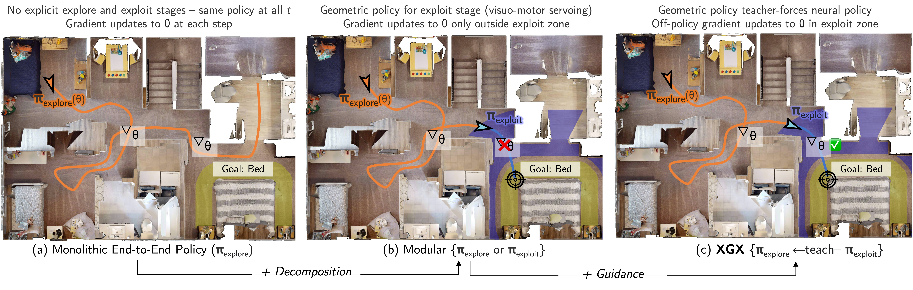

# Exploitation-Guided Exploration for Semantic Embodied Navigation

Broadly speaking this work is concerned with using a geometric policy that is very good at solving some portion of a task to guide exploration of a neural policy.



## Setting up Anaconda

```bash
# If you haven't already git cloned then - 
# git clone git@github.com:Jbwasse2/XGX.git
# Create anaconda environment
conda create --name xgx python=3.7
# Install Habitat-Sim and Scikit-fmm
conda install habitat-sim=0.2.1 withbullet headless -c conda-forge -c aihabitat
conda install -c conda-forge scikit-fmm=2019.1.30
# Install Habitat-Lab
cd habitat-lab
pip install -r requirements.txt
python setup.py develop --all # install habitat and habitat_baselines
cd ..
# Install your torch with your version of cuda, we use cu113
# See https://pytorch.org/get-started/previous-versions/ for commands
# if your version of cuda does not match
pip install torch==1.10.0+cu113 torchvision==0.11.0+cu113 torchaudio==0.10.0 -f https://download.pytorch.org/whl/torch_stable.html
pip install -r requirements.txt
```

## Setting up data and models

### HM3D Dataset

We utilzie the HM3D-V1 dataset. Details of this dataset can be found [here.](https://aihabitat.org/datasets/hm3d/) This dataset should be placed into `./data/scene_dataset/` yielding  for example `data/scene_datasets/hm3d/val/00877-4ok3usBNeis/4ok3usBNeis.basis.glb`

We also utilize the standard HM3D-V1 train/val splits. This can be found [here](https://github.com/facebookresearch/habitat-sim/blob/main/DATASETS.md#habitat-matterport-3d-research-dataset-hm3d). These splits should be placed into `./data/datasets/objectnav/` yielding as an example `data/datasets/objectnav/hm3d/v1/val/content/4ok3usBNeis.json.gz`.

### Models

We retrain RedNet to the HM3D dataset. We also used XGX to retrain a CNN+RNN model.

Both of these models can be found [here.](https://drive.google.com/drive/folders/1mv6ePcbzkI3sXSfiQb_tMABM7P7tsPID?usp=sharing)

Put both of these models in `./models`.

## Evaluation

Your code base should look like this

```bash
 .
 ├── arguments.py
 ├── category_mapping.tsv
 ├── configs
 │   ├── experiments
 │   └── tasks
 ├── data
 │   ├── scene_dataset
 │   └── datasets
 ├── habitat-lab
 ├── habitat-sim
 ├── models
 │   ├── hm3d_rednet.pt
 │   └── XGX.pth
 ├── pirlnav
 ├── README.md
 ├── run.py
 └── src 
```

Now run

```bash
python run.py --exp-config ./configs/experiments/XGX.yaml --run-type eval
```

After running this we recorded the following results

```bash
Average episode reward: 0.7275
Average episode distance_to_goal: 2.4974
Average episode success: 0.7275
Average episode spl: 0.3613
Average episode softspl: 0.3906
Average episode sparse_reward: 1.8188
Average episode num_steps: 160.5845
```
